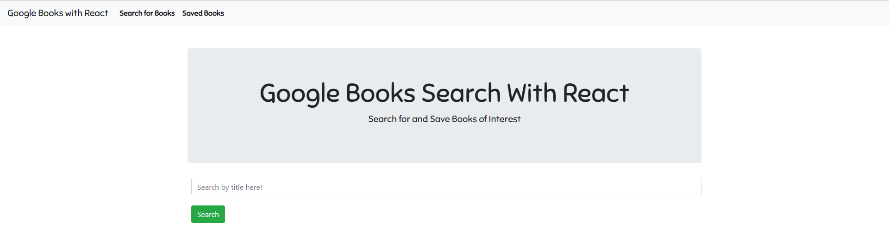
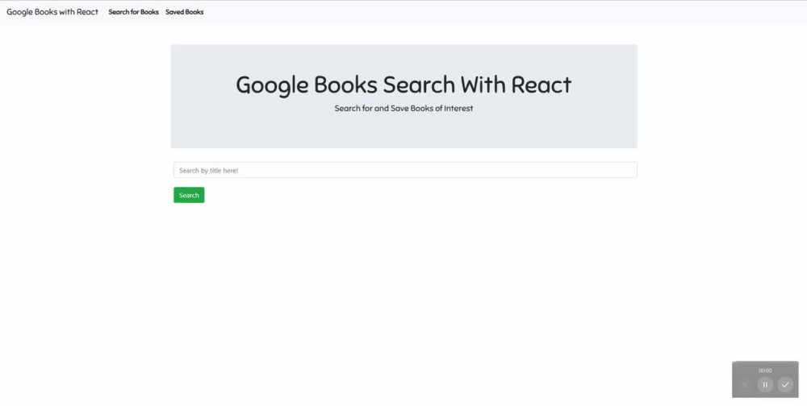
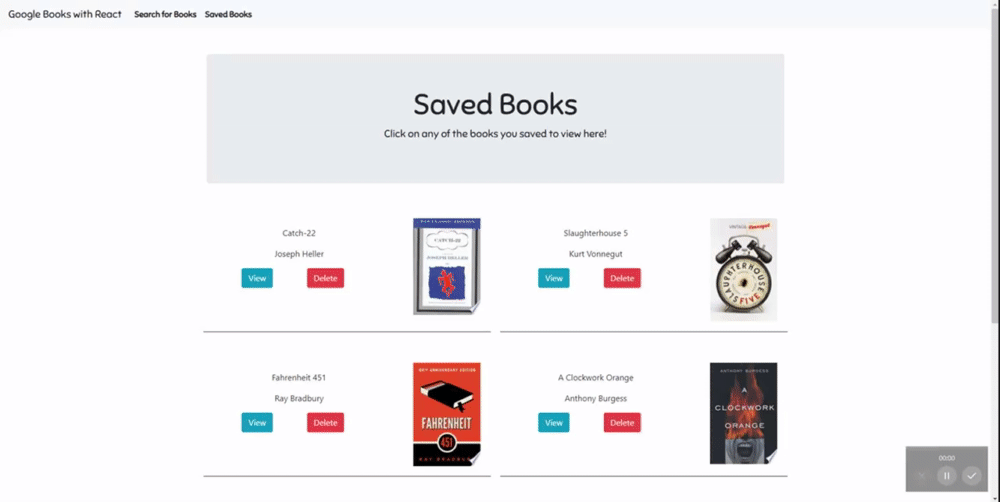

# React Google Books Search

## Deployed Link

To use the app, navigate to the deployed link on heroku found [here](https://immense-everglades-13293.herokuapp.com/)

## Description



This application allows users to utilize the vast array of data held by google books to search and save for books of interest. After querying books by title or author, users can sift through and save results, creating a list of saved books to be read in the future.

This application is a Mongoose-Express-React-Node (MERN) full-stack application. On the back-end, an express server listens for requests, and interacts with the mongodb database or the google books API to serve the user with results. React's stateful nature facilitates a clean and simple setup of the DOM which is dynamic and responsive to the user input.

## Table of Contents

* [Installation](#Installation)
* [Usage](#Usage)
* [License](#License)
* [Built With](#built-with)
* [Questions](#Questions)

## Installation

To access code for use or development, clone the Github repository onto your local machine using:

```
git clone https://github.com/sbarrow825/React-Google-Books-Search
```

To download the necessary dependencies, navigate into the cloned directory and enter the following in terminal:

```
npm install
```

To being running the react app on your local machine, navigate into the cloned repository and run:
```
npm start
``` 

## Usage

On the 'Search' page, users can:

* Search for new books, a feature which utilizes the google books API.
* View the search results enlarged on the section at the page's top.
* Save any of the search results.



On the 'Saved' page, users can:

* View any saved books enlarged at the top of the page.
* Delete books from the saved page



## License


## Built With

* [Javascript](https://developer.mozilla.org/en-US/docs/Web/JavaScript)
* [Express](https://www.npmjs.com/package/express)
* [Mongoose](https://mongoosejs.com/docs/)
* [Bootstrap](https://getbootstrap.com/)
* [React](https://reactjs.org/)


## Questions


For any questions concerning this project, please feel free to email me at sbarrow825@berkeley.edu

